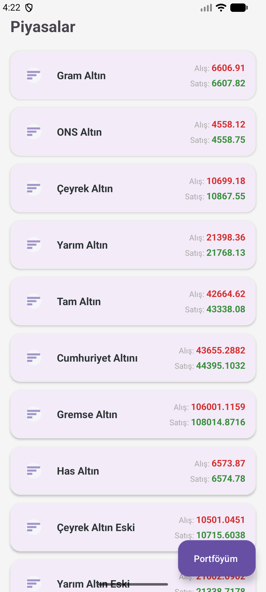
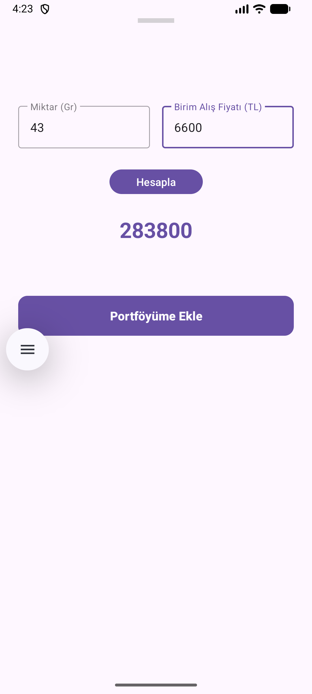
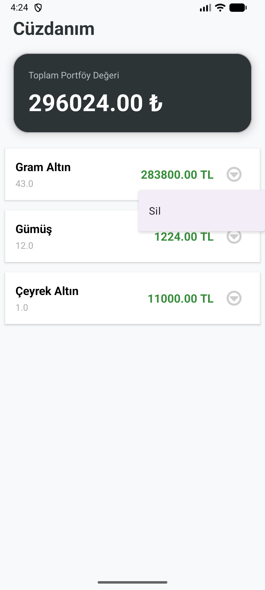

# 💰 Yerli Harem Döviz (Currency & Gold Tracker)

Piyasa takibini profesyonel bir seviyeye taşıyan, anlık döviz kurları ve kıymetli maden fiyatlarını kullanıcıya sunan modern bir finans uygulaması. Özellikle altın ve döviz piyasasındaki volatiliteyi anlık olarak takip etmek isteyen kullanıcılar için optimize edilmiştir.

## 📸 Ekran Görüntüleri

   
  
  

## 🚀 Öne Çıkan Özellikler
* **Anlık Piyasa Verileri:** Döviz kurları ve altın fiyatlarını eş zamanlı olarak takip etme.
* **Kıymetli Maden Takibi:** Gram altın, çeyrek altın ve diğer madenler için detaylı fiyatlandırma.
* **Kullanıcı Dostu Arayüz:** Finansal verilerin kolay okunmasını sağlayan temiz ve anlaşılır UI tasarımı.
* **Hızlı Performans:** Veri çekme ve işleme süreçlerinde minimum gecikme.

## 🛠️ Teknik Detaylar
* **Mimari:** MVVM (Model-View-ViewModel)
* **Dil:** Kotlin
* **Veri Kaynağı:** REST API Entegrasyonu (Retrofit & GSON)
* **Asenkron Yapı:** Coroutines ile verimli thread yönetimi
* **UI Bileşenleri:** LiveData ve ViewBinding ile reaktif arayüz güncellemeleri
